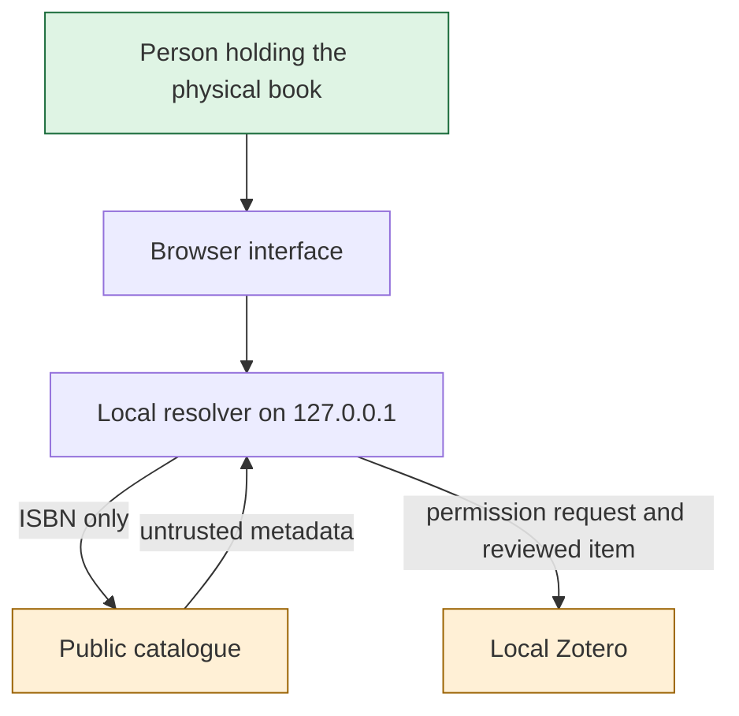

# Architecture

## Maintained v1.2 system

The public source contains two local implementations of the same evidence-first workflow:

1. A Python 3.10+ resolver with a standard-library web server, command-line interface, browser UI, RIS output, and local Zotero adapter.
2. A TypeScript/Bun desktop resolver that embeds the same browser assets and can be compiled into an experimental macOS application.

The exact Mobile version 7 production recovery is a separate private baseline and is not part of this repository.

```mermaid
flowchart LR
    A[Barcode or typed ISBN] --> B[Normalize and validate]
    B -->|invalid| C[Stop and explain]
    B --> D[Generate ISBN-10 and ISBN-13 forms]
    D --> E[Open Library by default]
    D -. authorized opt-in .-> F[Indonesia OneSearch]
    E --> G[Keep per-source status]
    F --> G
    G --> H[Reject non-equivalent ISBN records]
    H --> I[Cluster titles]
    I --> J[Separate editions and printings]
    J --> K[Preserve conflicts and provenance]
    K --> L{Decision state}
    L -->|ready| M[Final review]
    L -->|review or ambiguous| N[Compare physical book]
    N --> M
    M --> O{Output}
    O --> P[RIS]
    O --> Q[Local Zotero permission and duplicate check]
```

## Components

| Concern | Python | TypeScript/Bun |
| --- | --- | --- |
| ISBN rules | `isbn_zotero/isbn.py` | `src/isbn.ts` |
| Data contracts | `isbn_zotero/models.py` | `src/types.ts` |
| Catalogue adapters | `isbn_zotero/sources.py` | `src/sources.ts` |
| Reconciliation | `isbn_zotero/reconcile.py` | `src/reconcile.ts` |
| Cache and selection | `isbn_zotero/cache.py`, `resolver.py` | `src/cache.ts`, `resolver.ts` |
| RIS | `isbn_zotero/ris.py` | `src/ris.ts` |
| Zotero local API | `isbn_zotero/zotero_local.py` | `src/zotero.ts` |
| Local HTTP/UI | `isbn_zotero/webapp.py`, `static/` | `src/server.ts`, embedded assets |

## Trust boundaries

- Catalogue metadata is evidence, not authority.
- The physical book and informed human choice are the final authority.
- Browser state is not a security boundary; required acknowledgements are enforced by server logic.
- RIS and direct Zotero writes are output adapters over the same reviewed record.
- The public source contains no hosting manifest or production deployment connection.
