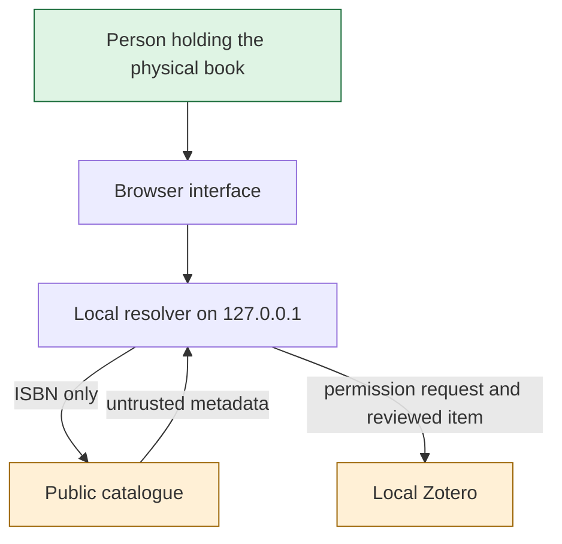

# Architecture

## Maintained v1.2 system

The public source contains two local implementations and two sanitized hosted
reference implementations of the same evidence-first workflow:

1. A Python 3.10+ resolver with a standard-library web server, command-line interface, browser UI, RIS output, and local Zotero adapter.
2. A TypeScript/Bun desktop resolver that embeds the same browser assets and can be compiled into an experimental macOS application.
3. A TypeScript/React Mobile v8 reference for iPhone barcode/manual ISBN entry,
   catalogue reconciliation, and the Zotero Web API.
4. A separate TypeScript/React Mac v3 Site reference that adds No ISBN, title
   search, and verified physical-book transcription.

The exact production checkouts and their Git histories remain private.
`mobile/` and `mac/` are reviewed public derivatives without hosting
registrations.

```mermaid
flowchart LR
    A[Barcode or typed ISBN] --> B[Normalize and validate]
    B -->|invalid| C[Stop and explain]
    B --> D[Generate ISBN-10 and ISBN-13 forms]
    D --> E[Open Library]
    D --> F[Indonesia OneSearch]
    D --> GB[Google Books]
    E --> G[Keep per-source status]
    F --> G
    GB --> G
    G --> H[Reject non-equivalent ISBN records]
    H --> I{Automatic candidate?}
    I -->|No| P[Open Perpusnas browser check]
    P -->|No record| W[Open WorldCat browser check]
    P -->|Record| T[Copy exact title]
    W -->|Record| T
    T --> TS[Continue in Mac title search]
    I -->|Yes| J[Cluster titles]
    J --> K[Separate editions and printings]
    K --> L[Preserve conflicts and provenance]
    L --> M{Decision state}
    M -->|ready| N[Final review]
    M -->|review or ambiguous| O[Compare physical book]
    O --> N
    N --> Q{Output}
    Q --> R[RIS]
    Q --> S[Zotero permission and duplicate check]
```

## Components

| Concern | Python | TypeScript/Bun |
| --- | --- | --- |
| ISBN rules | `isbn_zotero/isbn.py` | `src/isbn.ts` |
| Data contracts | `isbn_zotero/models.py` | `src/types.ts` |
| Catalogue adapters | `isbn_zotero/sources.py` | `src/sources.ts` |
| Reconciliation | `isbn_zotero/reconcile.py` | `src/reconcile.ts` |
| Cache and selection | `isbn_zotero/cache.py`, `resolver.py` | `src/cache.ts`, `resolver.ts` |
| RIS | `isbn_zotero/ris.py` | `src/ris.ts` |
| Zotero local API | `isbn_zotero/zotero_local.py` | `src/zotero.ts` |
| Local HTTP/UI | `isbn_zotero/webapp.py`, `static/` | `src/server.ts`, embedded assets |

The Mobile and Mac Site references keep ISBN resolution in `lib/resolver.ts`,
RIS output in `lib/ris.ts`, the Zotero Web API adapter in
`lib/zotero-cloud.ts`, server routes in `app/api/`, and their interfaces in
`app/page.tsx`. Each has a separate `lib/perpusnas.ts` URL builder. The Mac
reference additionally contains `lib/title-resolver.ts`, `lib/manual-book.ts`,
and `app/api/search-book/route.ts`.

## Catalogue adapter boundary

| Category | Services | Application behavior |
| --- | --- | --- |
| Automatic adapters | Indonesia OneSearch, Open Library, Google Books | Queried by the resolver and reconciled into candidates |
| First browser fallback | Perpusnas ISBN | Opened separately after no automatic candidate; no automatic import |
| Second browser fallback | WorldCat | Opened only if Perpusnas has no record; no automatic import |
| Normal recovery | Mac title search | Uses the exact observed title to resume candidate review |
| Exceptional final route | WorldCat RIS | Manual import only when the normal recovery route is unsuitable |

## Trust boundaries

- Catalogue metadata is evidence, not authority.
- The physical book and informed human choice are the final authority.
- Browser state is not a security boundary; required acknowledgements are enforced by server logic.
- RIS and direct Zotero writes are output adapters over the same reviewed record.
- The public source contains no production hosting manifest or deployment connection.
- Mobile and Mac remain separate Site identities; a source synchronization must
  never bind either derivative to a production project.
