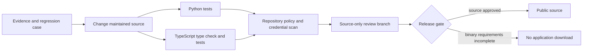
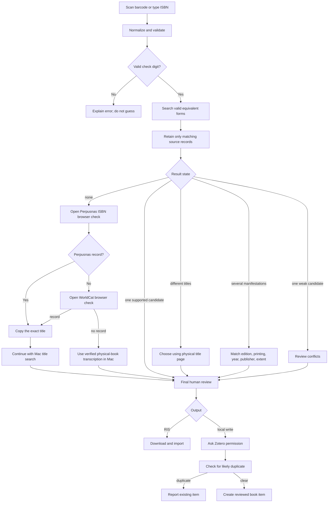
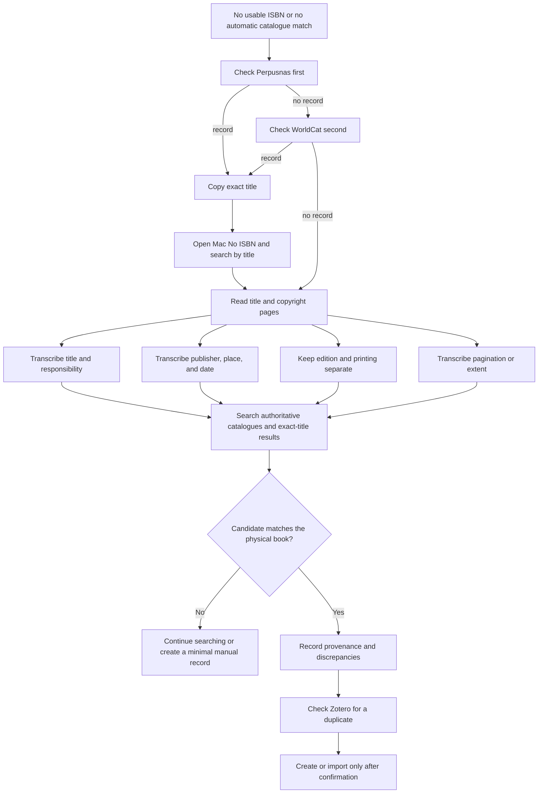

# Workflows

## Development workflow

## Runtime workflow

## Failed-record recovery workflow

Perpusnas is separate from Indonesia OneSearch and is not an automatic
metadata source. Neither Perpusnas nor WorldCat imports a record automatically.
WorldCat RIS import is an exceptional final option after the Mac title-recovery
route.

## Human verification checklist

- Read the physical title page and copyright/colophon page.
- Keep edition and printing/cetakan separate.
- Confirm names and roles; do not turn an editor into an author.
- Compare publisher, place, year, and extent.
- Leave uncertain fields blank and preserve an audit note.
- Search Zotero before creating a new item.
